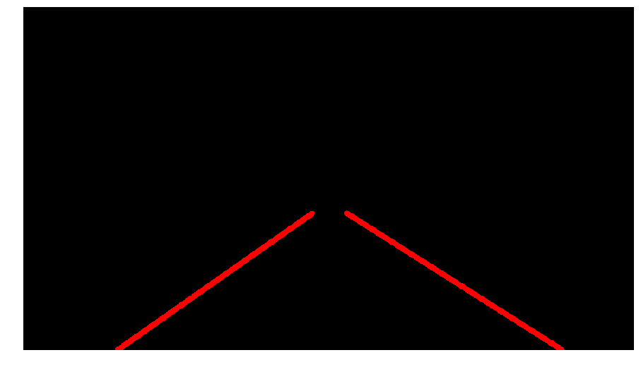
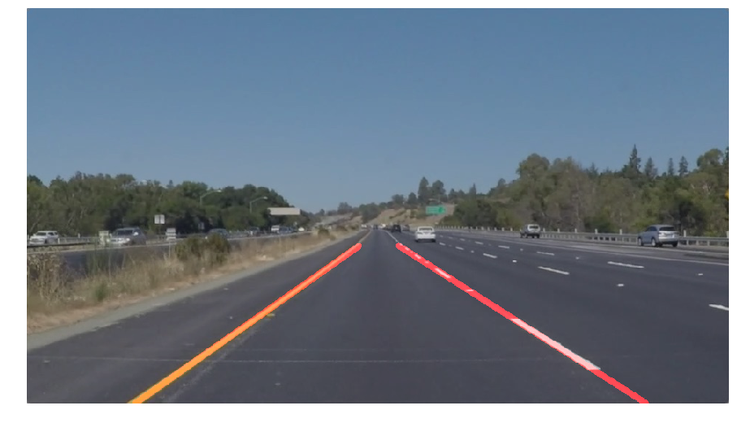

**Finding Lane Lines on the Road**

The goals / steps of this project are the following:
* Make a pipeline that finds lane lines on the road
* Reflect on your work in a written report

---

### Reflection

### 1. Describe your pipeline. As part of the description, explain how you modified the draw_lines() function.

My pipeline consisted of 6 steps.

In the first step I converted the image to grayscale.


In the next step I applied a gaussian blur with a kernel size of 3 to give me nice smooth edges.


In step 3 Canny edge detection was applied to the smoothed image. I used a low threshold of 60 and a high threshold of 140 for good results.


As the camera was mounted to the car I used a trapezoid shaped polygon somewhat aligned with the perspective to isolate an area where the lanes would be.


Transforming the remaining edges into Hough space would give me a set of line segments.
I had some good results with these settings:
```python
RHO = 2
THETA = np.pi / 180
MIN_VOTES = 80
MIN_LINE_LEN = 50
MAX_LINE_GAP = 30
```


These results were ok, however, we were interested in two lines only, the left lane and the right lane.
For every line `HoughLinesP` returned I would calculate its slope and y-intersect because we know a line is described as `f(x) = mx + n`. Based on the slope I could determine wether a line would lean to left or to the right and how much so.
At this point I decided to ignore lines that were too close to being horizontal or vertical as they were likely just noise.

I then calculated an average right lane and left lane based on the average slope & y-intersect. I would extend that line from the lowest y-value to the highest y-value I found.


In the final step I combined the line image with the original image.


This pipeline worked well on the still images as well as on the two images. However, when I tested it on the challenge video I got mixed results.


The concrete and shadows make line detection sketchy and result in jumpy lanes.
We can assume that even though a lane is not detected it is still there and not deviating too much from the previous frame.
By implementing a simple moving average filter I was able to produce a much smoother result.
I kept a record of the last 30 lanes found and used their average to draw my lanes.


### 2. Identify potential shortcomings with your current pipeline

This is a very primitive algorithm and there are several shortcomings:
- It's very much relying on high contrast to detect the edges and can easily fail in not perfect lighting conditions etc.
- Objects like other vehicles or even road paint in the area of interest can lead to incorrect results
- This will only work on a highway scenario, sharp turns, abrupt changes in direct, hills and other road markings will leave this algorithm useless

### 3. Suggest possible improvements to your pipeline

A small improvement which however would not address the shortcomings listed above would be
detecting outliers based on their deviation from historic slope measurements rather than setting static min/max values.
Potentially it could be an improvement catering for detection of curved lines rather than straight ones.
If we had more information on the camera's field lens and where it's mounted in respect to the road we could eventually do further improvements calculating the area of interest and predict lanes better.
